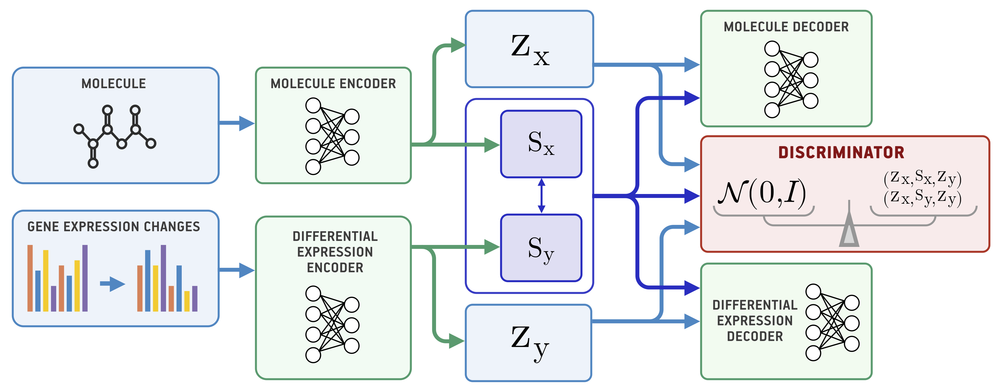

# Molecular Generation for Desired Transcriptome Changes with Adversarial Autoencoders

Recent advances in deep neural networks and the abundance of the experimental biological data enabled the development of systems for extracting new genomic, molecular and phenotypic features that could not be found using conventional methods. In this work, we build a conditional generative model that produces molecular descriptors based on the desired transcriptional response. However, experimental gene expression also captures cellular processes unrelated to the drug incubation, leading to overfitting of standard models. The proposed Bidirectional Adversarial Autoencoder explicitly separates these processes into related and unrelated, improving molecular descriptors generation. We validate our model on the LINCS L1000 dataset by generating fingerprints of compounds with the desired transcriptional response. We also demonstrate that our model implicitly learns a metric in the space of molecules and expressions, which can be useful downstream tasks of representation learning.

# Repository

In this repository, we provide an implementation of the proposed Bidirectional Adversarial Autoencoder (BiAAE) model and include an experiment on Noisy MNIST data.

## Installation

1. Install basic dependencies: `conda install numpy pandas matplotlib tqdm`
2. Install [pytorch](https://pytorch.org/) via `conda install pytorch torchvision -c pytorch`
3. Install and [tensorboardX](https://github.com/lanpa/tensorboardX) via `pip install tensorboardX`
4. Download the dataset by running `python download.py` from the root of the repository

## Training the model

To train a model, refer to `train.py` script, in which you can play with multiple hyperparameters. To train the model with default parameters, you can run `python train.py --name my_BiAAE`. To get more details on this script, run `python train.py --help`. We also provide a pretrained model saved at `models/BiAAE` that you can use for visualization. You can find example samples in the Visualization.ipynb notebook.
