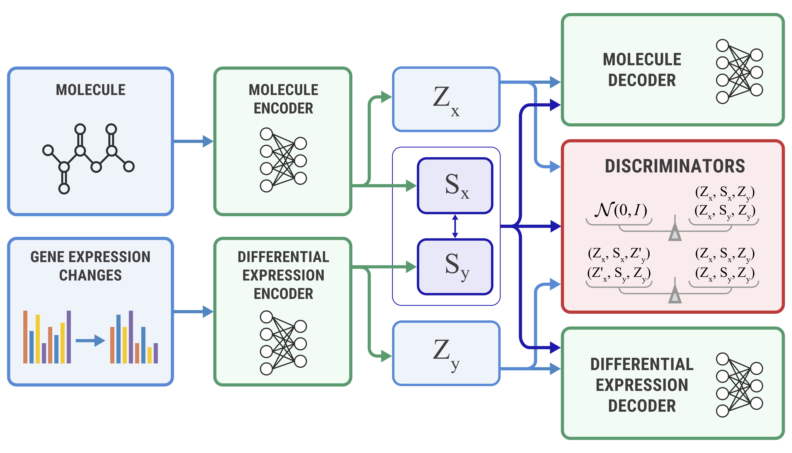

# Molecular Generation for Desired Transcriptome Changes with Adversarial Autoencoders

## Abstract

Gene expression profiles are useful for assessing the efficacy and side effects of drugs. In this paper, we propose a new generative model that infers drug molecules that could induce a desired change in gene expression. Our model—the Bidirectional Adversarial Autoencoder—explicitly separates cellular processes captured in gene expression changes into two feature sets those related and unrelated to the drug incubation. The model uses related features to produce a drug hypothesis. We have validated our model on the LINCS L1000 dataset by generating molecular structures in the SMILES format for the desired transcriptional response. In the experiments, we have shown that the proposed model can generate novel molecular structures that could induce a given gene expression change or predict a gene expression difference after incubation of a given
1 molecular structure. 



# Repository

In this repository, we provide an implementation of the proposed Bidirectional Adversarial Autoencoder (BiAAE) model and include an experiment on Noisy MNIST and LINCS datasets.

## Installation

1. Install basic dependencies: `pip install -r requirements.txt`.
2. To download the Noisy MNIST dataset, please run `python download.py` from the root of the repository.
3. To download pretraining molecular dataset, please run `cd data & wget https://media.githubusercontent.com/media/molecularsets/moses/master/data/train.csv`.
4. To download preprocessed data from LINCS L1000 level 3 dataset [1], please, use [the link](https://drive.google.com/drive/folders/1rMQmnAVMPPQxQTw0pjVvrGE-Toxys-w7?usp=sharing). Copy downloaded `lincs` folder to `data` folder.


## Training the model

To train a model, refer to scripts in folder `training_scripts`.

To see training dynamic and metrics, please, run `tensorboard --logdir=logs`.

# How to cite

```
@article{shayakhmetov2020BIAAE,
  title={Molecular Generation for Desired Transcriptome Changes with Adversarial Autoencoders},
  author={Shayakhmetov, Rim and Kuznetsov, Maxim and Zhebrak, Alexander and Kadurin, Artur and Nikolenko, Sergey and Aliper, Alexander and Polykovskiy, Daniil},
  journal={Frontiers in Pharmacology},
  volume={11},
  pages={269},
  year={2020},
  publisher={Frontiers}
}
```


-----------

[1] ```Subramanian A, et al. A Next Generation Connectivity Map: L1000 Platform And The First 1,000,000 Profiles. Cell. 2017/12/1. 171(6):1437–1452.```
